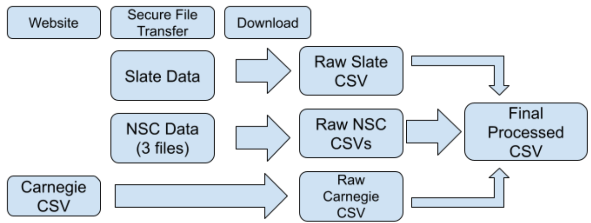

## Abstract

> We integrated three years of Willamette applicant data joined with National Student Clearinghouse enrollment data to predict an admitted but non-enrolled student’s enrollment destination category based on their application characteristics. Knowing what is most likely to influence a student’s decicision helps the Admissions and Enrollment Management teams create more targeted recruitment and yield strategies.

**Role:** Owner Product Lead
**Team:** [Courtney St. Onge](https://courtneysto.github.io)
**Capstone Website** [Willamette Applicant Trajectory](https://data-science-capstone-project-2026.github.io/)
**Public Repo:** [Github](https://github.com/Data-Science-Capstone-Project-2026/Public_Repository)

## The question

Currently, the Admissions office lacks a data-driven framework for segmenting admitted applicants by their predicted matriculation destination, which means that recruitment and yield strategies must be applied broadly rather than targeted to what differentiates Willamette from the other schools an applicant may be looking at. Understanding which type of institution a student is likely to choose would allow the team to tailor materials, financial aid messaging, and communications to what is most likely to influence a student’s decision.

## The data

We combined three years (2023–2025) of Willamette applicant records with national enrollment records for students who were admitted but chose not to attend Willamette.

| Dataset | Source | What it tells us |
|---------|--------|------------------|
| Applicant records | Willamette's Slate CRM | Everything about the application itself (academics, financials, campus engagement, demographics) |
| Enrollment destination | National Student Clearinghouse (NSC) | Where an admitted student who didn't come to Willamette actually enrolled instead |
| Institution classification | Carnegie Classification of Institutions of Higher Education | Used to sort each destination school into a size category for original research question |

Altogether, this covers about 9,400 applicants and roughly 6,500 confirmed non-Willamette enrollment outcomes after the two sources were matched together using an applicant's unique ID.

The diagram below shows how the raw files became a single, analysis-ready dataset.



Protecting student privacy was a top priority throughout this project:

- **No personally identifiable information (PII)**, such as names, birthdates,
  or contact information was ever included in the data used for analysis.
  Early on, we noticed that birthdate, sex, and gender together could
  potentially be used to re-identify a student even without a name attached,
  so those fields were removed before the data ever reached our project.
- **Restricted access.** Only the two team members could access
  the source data, by connection to the Willamette campus network, using a combination of a raw password, a public/private key pair held exclusively on the two team members' local devices, and an IP whitelist. 
- **Confidentiality agreement.** Both team members signed a formal
  confidentiality agreement governing use of this data, and the raw data was
  never shared with classmates, external stakeholders, or the public.

Because of these protections, the raw and processed data files themselves
are **not included** in our public GitHub repository.

## The approach

We analyzed two destination groupings as part of an iterative refinement process. With stakeholder input, we landed on four main destination categories:

- **NW5**:  Willamette's closest private peer institutions in the Pacific
  Northwest (Reed College, Lewis & Clark College, Whitman College, and
  University of Puget Sound)
- **Three Large Public**: Oregon State University, University of Oregon,
  and Portland State University
- **Local Public**: other public colleges in Oregon and Washington
- **Local Private**: other private colleges in Oregon and Washington


This project started with an exploratory stage to construct and validate features and applicant groupings, followed by a supervised classification stage to predict enrollment destination.

Exploratory data analysis was conducted in R and done across the different feature groupings. Applicant attributes were then transformed into model-ready features in Python(feature engineering).

Clustering was applied to identify natural groupings in enrollment destination patterns. To assess whether the cluster membership aligned meaningfully with the enrollment destination categories, a chi-square test of independence was run with Cramer’s V used to quantify the strength of the association. 

Three classification approaches were compared for the predictive task: Multinomial Logistic Regression (MLR) as an interpretable baseline, Support Vector Machines (SVM) as an alternative classifier, and XGBoost, selected for its native handling of missing values. The strongest performing model was then focused on for hyperparameter tuning and feature identification.

## Findings

Lead with your best figure or your architecture diagram.

{fig-alt="Placeholder capstone figure" width="90%"}

State the finding in plain language, then the caveat. Sparse and true beats
full and shaky.

## The full write-up

```markdown
[Download the write-up (PDF)](projects/capstone/writeup.pdf){.btn .btn-primary}

<iframe src="projects/capstone/writeup.pdf" width="100%" height="800px"
  style="border: 1px solid #ddd;"></iframe>
```

## Dig deeper

- 📦 **Code & pipeline:** [Willamette Applicant Trajectory - Capstone2026](https://github.com/Data-Science-Capstone-Project-2026/Public_Repository)
- 📊 **Website:** [Willamette Applicant Trajectory](https://data-science-capstone-project-2026.github.io/)
