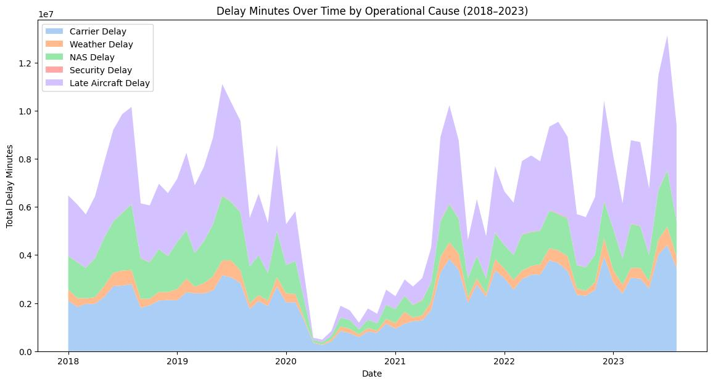

## What it is

For our final project, my partner and I conducted an end-to-end analysis of U.S. airline delay data and publicly available stock prices to explore the relationship between operational performance and financial outcomes. Using Python, we analyzed delay drivers, normalized delay rates, and airline stock valuations from 2018–2023. While delays showed clear operational patterns, the analysis found no strong statistical relationship between delay performance and stock valuation, highlighting how broader market forces often outweigh short-term operational disruptions. This project strengthened my skills in data wrangling, exploratory analysis, regression modeling, and communicating complex operational and financial insights to a non-technical audience.

## What I did

- Built and evaluated 2 regression models (LASSO on airline identity, MLR on month/flight volume) to test predictors of delay rate, finding neither sufficient and redirecting analysis toward operational causes
- Designed 4 visualizations: delay-by-cause time series, best-5-vs-worst-5 delay rate ranking, operational cause comparison, and correlation heatmaps - to surface operational drivers of delay
- Found worst-performing airlines show ~0.9 cross-cause correlation vs. moderate correlation for top performers, indicating delays cascade through fragile operational systems rather than isolated events

## Outputs

[Download the write-up (PDF)](CS501_Final.pdf){.btn .btn-primary}

<iframe src="CS501_Final.pdf" width="100%" height="800px"
  style="border: 1px solid #ddd;"></iframe>

