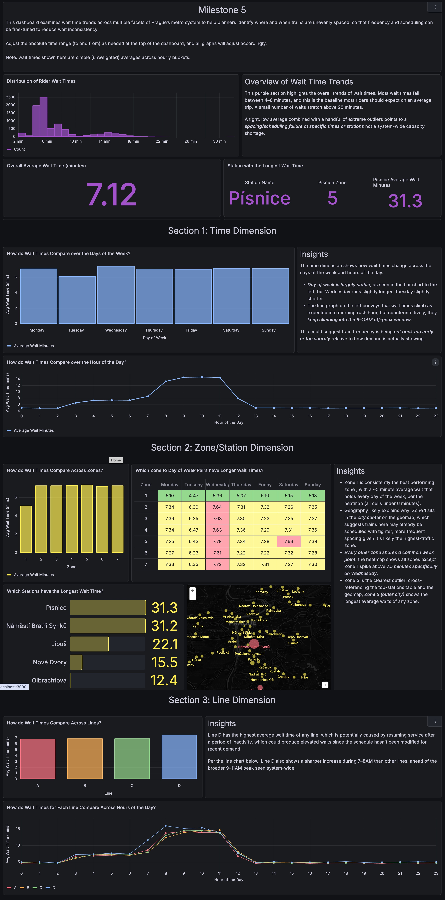

## What it is

This was a semester-long, team-based data engineering project simulating a real-world transit analytics pipeline. The team ingested data from five distinct source types — a relational database, a document database, a graph database (Neo4j), a REST API, and Kafka event streams — and used Airflow-orchestrated DAGs to snapshot this data daily into an S3-based data lake (RustFS). A second set of dependent DAGs loaded the snapshots into staging tables in a data warehouse, after which dbt models transformed the raw data into business-specific star schemas, each built around a fact table (holding aggregated metrics like average wait time, ride counts, or time-in-system) connected to supporting dimension tables (time, station, route, zone, fare type, etc.) via surrogate and foreign keys. These dbt transformations ran on a schedule via Airflow, keeping the warehouse continuously refreshed for analysis. The pipeline supported six rotating milestones, each tied to a different business question, with results surfaced through Grafana dashboards. One milestone, for example, modeled and visualized how passenger wait times varied by time of day, day of week, line, zone, and station. Midway through the semester, project ownership rotated between teams, requiring thorough documentation including data dictionaries, data lineage, and architecture decision records, so incoming teams could pick up and extend the pipeline.

## What I did

- Designed and built the Grafana dashboards using SQL for every milestone, translating business questions into clear, accurate visualizations
- Brainstormed and designed dimensional schemas (fact/dimension tables) tailored to each milestone's business question
- Contributed to team documentation, including data dictionaries, data lineage, and architectural decision records, to support project handoffs during rotations

## Links

[Download A Milestone Dashboard (JPG)](prague_dashboard.jpg){.btn .btn-primary}

